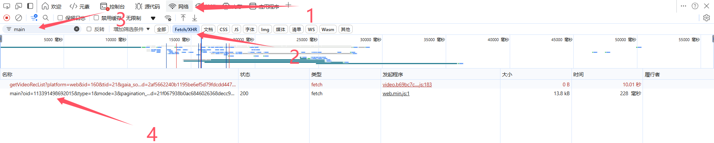
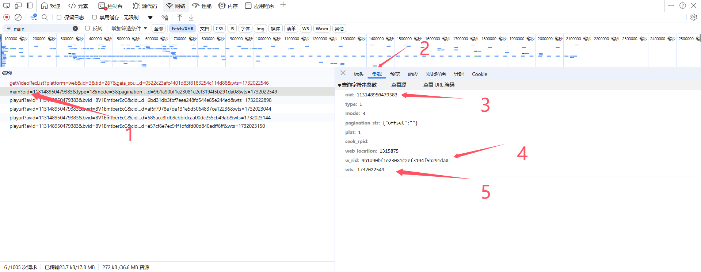
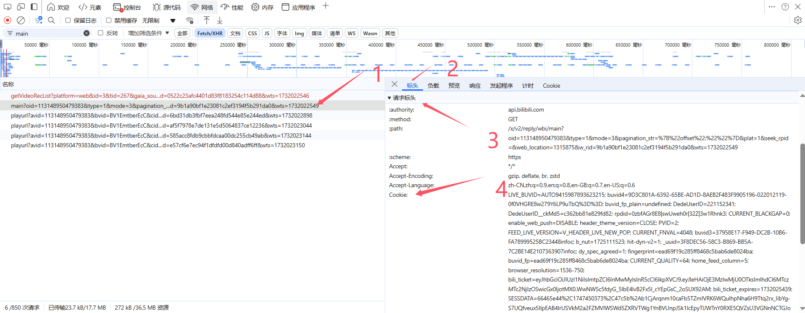

# 一、开发者声明

感谢您使用本项目！在使用代码之前，请务必阅读以下免责声明：

1. 本项目代码仅供学习和研究之用，旨在帮助开发者了解网页数据采集的基本原理和技术。请勿将本项目用于任何非法或违反某视频网站用户协议的行为。
2. 由于使用本代码所带来的任何后果，包括但不限于账号封禁、法律责任等，均由使用者自行承担，与本项目的开发者无关。开发者不对任何由于本项目的使用而产生的直接或间接损失负责。
3. 本代码在使用过程中需要提供个人账号的cookie以获取评论数据。请务必谨慎对待您的账号和个人信息。请爱惜您的账号，避免滥用，确保您在遵守视频网站相关服务条款的前提下进行操作。
4. 请严格遵守各项法律法规以及目标网站的爬虫相关政策，未经许可请勿对目标网站进行大规模数据抓取。

**再次强调：本项目仅供学习，请务必遵守法律法规及目标网站的相关规定。**

# 二、项目介绍

本项目可以定向爬取B站视频下方评论，会递归的将子评论也一并爬取，最后存储为JSON格式。

检索关键字：b站爬虫、b站评论爬取

# 三、使用说明

## 1.安装库

本项目只用到了request一个外部库，因此也可以直接在终端使用

`pip install requests`安装。

## 2.修改要爬取的视频参数

首先用浏览器打开视频播放页，按F12打开控制台，通过过下图所示找到一条`main?oid....`开头的请求。(如果没有，请保持控制台打开，然后刷新网页，这条请求会在你滚动到评论区时触发)

选中这条记录，在负载选项卡下，即可看到请求参数。

把`oid、w_rid、wts`填写到117行main函数的参数中，其中参数`output_file_name`是结果保存的文件名。

## 3.填写header

评论请求的顺利相应必须要求用户登录，因此你还需要在请求头中添加你的`cookie`和agents

查看方法也很简单，还是在刚才的请求中，切换到`标头`选项卡下，下拉滚动条找到`请求头`信息

把里面的`Cookie`和最下面的`user-agent`放到代码的11~13行。

